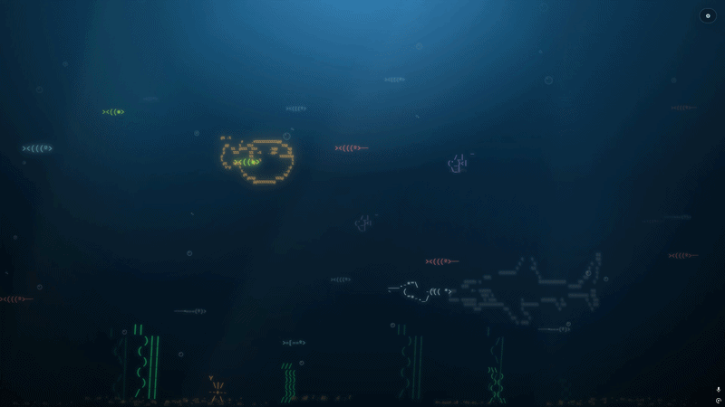

<!--


-->

<h1 align="center" style="color:yellow">🐠 ASCuarium</h1>
<p align="center"> <strong>A serious engine for unserious fish.</strong> </p>


<p align="center">
<a href="https://dormandel.github.io/ASCuarium/">🌐 Live Demo</a> 
 • 
<a href="https://github.com/DorManDel/ASCuarium">📦 Repo</a>
</p>

<!-- Sheilds and Icons : -->
<p align="center">
  
  
  
</p>

<!-- 
<p align="center"> 
  <summary align="center" style="color:grey">A full-page animated ASCII aquarium background made with HTML, CSS, and JavaScript.</summary>
</p>
-->

<p align="center" style="color:cyan">
  🐠 Fish &nbsp; • &nbsp; 🦈 Shark &nbsp; • &nbsp; ⚔️ Swordfish &nbsp; • &nbsp; 🫧 Bubbles &nbsp; • &nbsp; 🌿 Seaweed &nbsp; • &nbsp; ⚙️ Settings Panel
</p>

---

## 📸 Preview 


<details style="color:grey">
<p align="center">
  <p align="center"> 
  A full-page animated ASCII aquarium background made with HTML, CSS, and JavaScript.
  </p>
  
  <p align="center"> 
  📌 Popping a Puffer Fish on mouse Click! 🐡
  </p>
  
  <p align="center"> 
  image of the ASCII-quarium v1.0.0 showing broken Hammerfish
  </p>
  

</p>
</details>

---

## ✨ Features 

| Feature | icon|Status | Description |
|---|---:|---:|---|
| Full-page aquarium |🌊| ✅ | No frame, no wrapper, no card. The aquarium fills the entire screen. |
| Animated ASCII fish |🐠| ✅ | Fish are generated dynamically with JavaScript. |
| Shark |🦈| ✅ | Large ASCII shark moving in the background. |
| Swordfish |⚔️| ✅ | Long-nose swordfish included in the fish system. |
| Bubbles |🫧| ✅ | Random bubbles rise from the bottom of the page. |
| Seaweed |🪸| ✅ | Animated bottom plants with gentle sway. |
| Depth system |🔵| ✅ | Fish use `depth-1` to `depth-5` for z-axis feeling. |
| Settings popup |🍿⬆️| ✅ | Sliders control fish amount, bubbles, speed, depth and water tone. |
| Modular files |📂| ✅ | Split into `index.html`, `style.css`, and `script.js`. |

---

## 📁 Project Structure 🏛️

```txt
dorutils_ascii_aquarium_bg/
│
├── index.html      # Page structure
├── style.css       # Full-page ocean styling and animations
├── script.js       # Dynamic fish, bubbles, depth and settings logic
└── README.md       # Project documentation
```

---

## 🚀 How to Run
<details>

### Option 1 — Open Link from Github - as HTML page
<a href="https://dormandel.github.io/ASCuarium/">🪸🫧 Live Git Demo 🫧🐠</a>

### Option 2 — Open directly

Open `index.html` in your browser.

### Option 3 — VS Code Live Server

1. Open the project folder in VS Code.
2. Install the **Live Server** extension.
3. Right-click `index.html`.
4. Choose **Open with Live Server**.

### Option 4 — Python local server

```bash
python -m http.server 5500
```

Then open:

```txt
http://localhost:5500
```

Alternative:

```bash
python3 -m http.server 5500
```
</details>

---

## 🧠 How It Works

<details>

### `index.html`

The HTML file contains only the base stage and settings panel.

```html
<section id="aquarium" class="aquarium"></section>
```

JavaScript injects the fish, shark, swordfish, seaweed and bubbles into this element.

---

### `style.css`

The CSS makes the aquarium cover the full page:

```css
.aquarium {
  position: fixed;
  inset: 0;
  width: 100vw;
  height: 100vh;
}
```

The depth layers simulate distance:

```css
.depth-1 {
  opacity: 0.28;
  font-size: 12px;
  filter: blur(1.6px);
}

.depth-5 {
  opacity: 1;
  font-size: 21px;
  filter: drop-shadow(0 0 10px currentColor);
}
```

---

### `script.js`

The JavaScript creates elements dynamically:

```js
const element = document.createElement("pre");
element.textContent = config.art.trim();
aquarium.appendChild(element);
```

Fish are generated from blueprints:

```js
const fishBlueprints = [
  { art: ASCII.fishSmall, tint: "tint-yellow" },
  { art: ASCII.fishTiny,  tint: "tint-blue" },
  { art: ASCII.swordfish, tint: "tint-silver" }
];
```
</details>

---

## ⚙️ Settings Panel 📐

<details>

## 🎮 Controls

Open settings ⚙️ to control:

- Fish count
- Bubble amount
- Speed
- Depth color

The settings popup currently controls:

| Slider | What it controls |
|---|---|
| Fish Amount | Number of fish rendered |
| Bubble Amount | Number of bubbles rendered |
| Depth Strength | How deep/distant the fish feel |
| Speed | Animation speed |
| Water Tone | Background water brightness/tone |

</details>

---

## 🎨 Depth System 🔵

<details>

| Depth | Meaning | Visual Style |
|---|---|---|
| `depth-1` | Very far | Dark, small, blurry |
| `depth-2` | Far | Muted and slightly blurry |
| `depth-3` | Middle | Balanced |
| `depth-4` | Close | Bright and sharp |
| `depth-5` | Very close | Bright, larger, glowing |

</details>

---

## 🧩 Add Another Fish 🐠

<details>

In `script.js`, add a new blueprint:

```js
fishBlueprints.push({
  art: `><((((*>`,
  tint: "tint-yellow"
});
```

Or add another ASCII type inside the `ASCII` object:

```js
bigFish: `><((((º>`
```

Then use it:

```js
{ art: ASCII.bigFish, tint: "tint-pink" }
```

</details>

---

## 🫧 Add More Bubbles 🫧

<details>

Increase the slider in the settings panel, or change the default value in `index.html`:

```html
<input id="bubbleAmount" type="range" min="5" max="100" value="36" />
```
</details>

---


## 🧪 Common Problems ⚠️

<details>

### Blank blue page 🟦

Usually means JavaScript did not run. [❌🏃🏻‍♂️]

Check:

```html
<script src="script.js"></script>
```

Make sure it appears before `</body>`.

### CSS works but no fish appear

Open DevTools → Console and look for JavaScript errors.

Common mistakes:

```js
const creatures = [
```

missing before array items, or unclosed template strings.

### Settings opens but sliders do nothing

Click **Apply** after changing sliders.

</details>

---

## 🛠️ Built With 🏗️

| Technology | Usage |
|---|---|
| HTML | Page structure |
| CSS | Ocean background, movement, depth and popup |
| JavaScript | Dynamic generation and settings logic |
| ASCII Art | Fish, shark, swordfish and seaweed |

---

<details>

---

---

## 🧠 Developer Notes — How ASCuarium Works

<details>

<summary style="color:grey">  🐠 Open the engine breakdown  </summary>

ASCuarium is built like a tiny browser-based aquarium engine.

It looks silly, but the structure is real:

```txt
HTML  → creates the stage and settings panel
CSS   → controls visuals, movement, depth, glow and popup styling
JS    → creates fish, bubbles, seaweed, sand, settings and saved preferences
🧱 Core Idea
```
The aquarium does not contain fish directly in the HTML.

Instead, JavaScript creates them dynamically:
```bash
const element = document.createElement("pre");
element.textContent = config.art.trim();
aquarium.appendChild(element);
```
Each creature is a <'pre'> element so ASCII spacing is preserved.

## 🐟 ASCII Library

The ASCII object stores all visual drawings:
```bash
const ASCII = {
  fishSmall: `><(((º>`,
  pufferFish: `><(((●)>`,
  seaweedA: `...`
};
```

This keeps the art separate from the logic.

### * Question❔: Why this is useful?

### * Answer 🅰️: If I want to change a fish, I only edit the ASCII art once.

## 🧬 Fish Arsenal

fishArsenal is the fish database.

Each fish has:
```bash
{
  name: "Puffer Fish",
  art: ASCII.pufferFish,
  tint: "tint-orange",
  face: "right",
  behavior: "puffer"
}
```
| Command #   |   Explaination ?                  |
|---      |                                    ---|
|Property |	Meaning                               |
|name     |	 Display name in the settings panel   |     
|art	    |   Which ASCII drawing to use          |
|tint     |	CSS color class                       |
|face     |	Natural direction of the fish         |
|behavior	|Special logic such as puffer behavior  |


## 🎲 Fish Manager

#### FishManager controls fish spawning.

It decides:
- [x] Which fish to create
- [x] Which direction it swims
- [x] Whether it needs to flip
- [x] What depth it belongs to
- [x] How fast it moves

Simple idea:

```Pick fish``` → ```pick direction``` → ```apply classes``` → ```create element```

## 🔁 Render Engine

#### renderAquarium() rebuilds the aquarium.

```c++
function renderAquarium() {
  clearGeneratedElements();
  applyWaterTone();

  FishManager.createSchool(fishAmount);
  FishManager.createShark();
  FishManager.createSpecificFish("Puffer Fish");
  SeaweedManager.createSeaweedField();

  createSandPatch();
  createBubble();
}
```
Simple explanation :

```txt
Every time settings are applied, the old generated objects are removed and a new aquarium is created.
```

### Expert explanation :

```
This is a basic render pipeline.
The aquarium state is regenerated from current UI settings.
```

## 🌊 Depth System

Fish get a class from:
```
depth-1
depth-2
depth-3
depth-4
depth-5
```

#### Each depth changes:

```
-- opacity
-- size
-- blur
-- glow
-- z-index
```

This creates fake 3D depth using only CSS.

## 🫧 Bubble System

Bubbles are simple <span> elements.

Each bubble gets random:

```
- size
- horizontal position
- animation duration
- delay
- opacity
```
#### This makes the aquarium feel alive without complex logic.

## 🌿 Seaweed Manager

- Seaweed is generated like fish, but stays near the bottom.

Each plant has:
```HTML
{
  name: "Tall Seaweed",
  art: ASCII.seaweedTall,
  className: "seaweed-tall"
}
```
CSS handles the sway animation.

## ⚙️ Settings Panel

### The settings panel controls:
```
[+] Setting	What it changes
[+] Fish Amount	Number of fish
[+] Fish Variety	How many fish types are allowed
[+] Bubble Amount	Number of bubbles
[+] Seaweed Amount	Number of plants
[+] Depth Strength	How much depth variation exists
[+] Speed	Animation speed
[+] Water Tone	Ocean brightness
[+] 💾 localStorage
```
ASCuarium saves settings using:

```HTML
localStorage.setItem(STORAGE_KEY, JSON.stringify(settings));
```

*** This means preferences stay after refresh. ***

Used for:

```
[📌] slider values
[📌] fish amount
[📌] speed
[📌] depth
[📌] water tone
[📌] selected fish types
[📌] ☑️ Fish Picker
```
The fish picker is generated from fishArsenal.

That means adding a fish automatically makes it appear in the settings list.
```
Add fish to fishArsenal
↓
Settings panel gets checkbox
↓
Fish can be toggled on/off
🧨 Puffer Fish Mechanic
```

The puffer fish has special behavior.


Normal:
<p style=color:orange>
`
><(((●)>
`

Puffed:

```

           @% :%
          #    .#%%%%%%%%%%%@@
  @@     %   %%#              %%@
 @   %%  @%%%  %%#      .%@@     %@
 @    %%%     %%  =%   ..@@=     %@
@             %%             %%%%%%@
%     ....    .#  -%               %
 @%   %@%%      #*                 %
  %*@    %                       :@
          %.                    -@
           @%                  %@
             @%%@          %%%@
                @@%%%%%%%%@

```

#### Mechanic:
```
spawn normally
wait random time
become puffed
click while puffed
POP!
return to normal
```

This is done by swapping the fish text content.

### 🎨 CSS Tricks Used :

```txt
-Trick-	                  -Purpose-
- - position:             fixed	Full-screen aquarium
- radial-gradient	      Ocean lighting
- linear-gradient	      Water depth
- text-shadow	ASCII     glow
- filter: blur()	      Far depth effect
- z-index	              Layer ordering
- animation-delay	      Random movement timing
- white-space:            pre	Preserve ASCII formatting
- <details>	              Expandable settings section
- localStorage	          Save preferences
```

## 🧪 Main Lessons :

This project teaches:

```
DOM manipulation
data-driven design
CSS animation
localStorage
UI controls
random generation
separation of concerns
render pipelines
debugging visual systems
turning nonsense into architecture
🧃 Philosophy
```


# This project has no reason to exist.

<p align=right style=color:red>
 That is exactly why it should exist.
</p>

ASCuarium is a chill experiment in making something fun, weird, visual, and expandable.

No pressure.
No product pitch.
Just fish.


## 📌 Roadmap 🗺️

- [ ] Add pause/play button
- [ ] Add color picker for water
- [ ] Add separate fish color controls
- [ ] Add fish speed per depth
- [ ] Add food particles
- [ ] Add mouse interaction
- [ ] Add click-to-spawn fish
- [ ] Add DorUtils homepage content overlay
- [v] Add localStorage to save settings
- [ ] Add theme presets

---

##  💳 Credits 🪪

```txt
Created by **Dor Mandel** as part of the DorUtils visual background experiments.
---
Made with : HTML + CSS + JS + ASCII.
```
