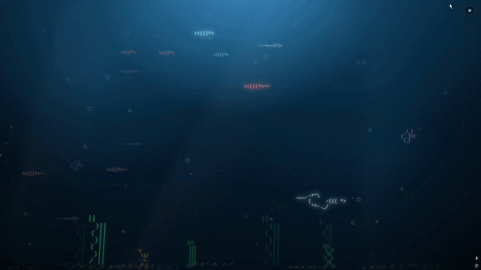
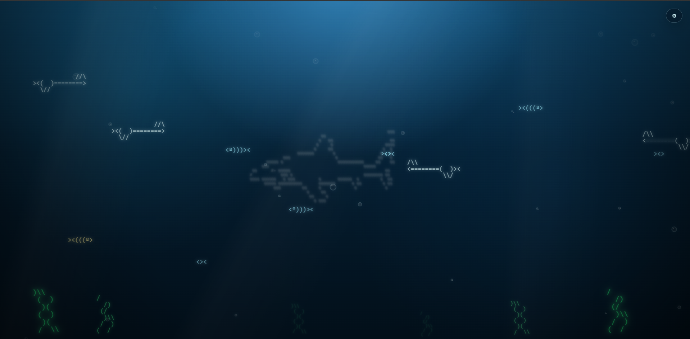

<h1 align="center">🐠 ASCuarium</h1>
<p align="center">Animated ASCII Ocean for the Browser</p>

<p align="center">
<a href="https://dormandel.github.io/ASCuarium/">🌐 Live Demo</a> •
<a href="https://github.com/DorManDel/ASCuarium">📦 Repo</a>
</p>

<p align="center">
  <strong>A full-page animated ASCII aquarium background made with HTML, CSS, and JavaScript.</strong>
</p>

<p align="center">
  🐠 Fish &nbsp; • &nbsp; 🦈 Shark &nbsp; • &nbsp; ⚔️ Swordfish &nbsp; • &nbsp; 🫧 Bubbles &nbsp; • &nbsp; 🌿 Seaweed &nbsp; • &nbsp; ⚙️ Settings Panel
</p>

---

## 📸 Preview 


<p align="center">
  
</p>

---

## ✨ Features 

| Feature | icon|Status | Description |
|---|---:|---:|---|
| Full-page aquarium |🌊| ✅ | No frame, no wrapper, no card. The aquarium fills the entire screen. |
| Animated ASCII fish |🐠| ✅ | Fish are generated dynamically with JavaScript. |
| Shark |🦈| ✅ | Large ASCII shark moving in the background. |
| Swordfish |⚔️| ✅ | Long-nose swordfish included in the fish system. |
| Bubbles |🫧| ✅ | Random bubbles rise from the bottom of the page. |
| Seaweed |🪸| ✅ | Animated bottom plants with gentle sway. |
| Depth system |🔵| ✅ | Fish use `depth-1` to `depth-5` for z-axis feeling. |
| Settings popup |🍿⬆️| ✅ | Sliders control fish amount, bubbles, speed, depth and water tone. |
| Modular files |📂| ✅ | Split into `index.html`, `style.css`, and `script.js`. |

---

## 📁 Project Structure 🏛️

```txt
dorutils_ascii_aquarium_bg/
│
├── index.html      # Page structure
├── style.css       # Full-page ocean styling and animations
├── script.js       # Dynamic fish, bubbles, depth and settings logic
└── README.md       # Project documentation
```

---

## 🚀 How to Run
<details>

### Option 1 — Open Link from Github - as HTML page
![link]https://dormandel.github.io/ASCuarium/

### Option 2 — Open directly

Open `index.html` in your browser.

### Option 3 — VS Code Live Server

1. Open the project folder in VS Code.
2. Install the **Live Server** extension.
3. Right-click `index.html`.
4. Choose **Open with Live Server**.

### Option 4 — Python local server

```bash
python -m http.server 5500
```

Then open:

```txt
http://localhost:5500
```

Alternative:

```bash
python3 -m http.server 5500
```
</details>

---

## 🧠 How It Works

<details>

### `index.html`

The HTML file contains only the base stage and settings panel.

```html
<section id="aquarium" class="aquarium"></section>
```

JavaScript injects the fish, shark, swordfish, seaweed and bubbles into this element.

---

### `style.css`

The CSS makes the aquarium cover the full page:

```css
.aquarium {
  position: fixed;
  inset: 0;
  width: 100vw;
  height: 100vh;
}
```

The depth layers simulate distance:

```css
.depth-1 {
  opacity: 0.28;
  font-size: 12px;
  filter: blur(1.6px);
}

.depth-5 {
  opacity: 1;
  font-size: 21px;
  filter: drop-shadow(0 0 10px currentColor);
}
```

---

### `script.js`

The JavaScript creates elements dynamically:

```js
const element = document.createElement("pre");
element.textContent = config.art.trim();
aquarium.appendChild(element);
```

Fish are generated from blueprints:

```js
const fishBlueprints = [
  { art: ASCII.fishSmall, tint: "tint-yellow" },
  { art: ASCII.fishTiny,  tint: "tint-blue" },
  { art: ASCII.swordfish, tint: "tint-silver" }
];
```
</details>

---

## ⚙️ Settings Panel 📐

<details>

The settings popup currently controls:

| Slider | What it controls |
|---|---|
| Fish Amount | Number of fish rendered |
| Bubble Amount | Number of bubbles rendered |
| Depth Strength | How deep/distant the fish feel |
| Speed | Animation speed |
| Water Tone | Background water brightness/tone |

</details>

---

## 🎨 Depth System 🔵

<details>

| Depth | Meaning | Visual Style |
|---|---|---|
| `depth-1` | Very far | Dark, small, blurry |
| `depth-2` | Far | Muted and slightly blurry |
| `depth-3` | Middle | Balanced |
| `depth-4` | Close | Bright and sharp |
| `depth-5` | Very close | Bright, larger, glowing |

</details>

---

## 🧩 Add Another Fish 🐠

<details>

In `script.js`, add a new blueprint:

```js
fishBlueprints.push({
  art: `><((((*>`,
  tint: "tint-yellow"
});
```

Or add another ASCII type inside the `ASCII` object:

```js
bigFish: `><((((º>`
```

Then use it:

```js
{ art: ASCII.bigFish, tint: "tint-pink" }
```

</details>

---

## 🫧 Add More Bubbles 🫧

<details>

Increase the slider in the settings panel, or change the default value in `index.html`:

```html
<input id="bubbleAmount" type="range" min="5" max="100" value="36" />
```
</details>

---

## 🧪 Common Problems ⚠️

### Blank blue page 🟦

Usually means JavaScript did not run. [❌🏃🏻‍♂️]

Check:

```html
<script src="script.js"></script>
```

Make sure it appears before `</body>`.

### CSS works but no fish appear

Open DevTools → Console and look for JavaScript errors.

Common mistakes:

```js
const creatures = [
```

missing before array items, or unclosed template strings.

### Settings opens but sliders do nothing

Click **Apply** after changing sliders.

---

## 🛠️ Built With 🏗️

| Technology | Usage |
|---|---|
| HTML | Page structure |
| CSS | Ocean background, movement, depth and popup |
| JavaScript | Dynamic generation and settings logic |
| ASCII Art | Fish, shark, swordfish and seaweed |

---

## 📌 Roadmap 🗺️

- [ ] Add pause/play button
- [ ] Add color picker for water
- [ ] Add separate fish color controls
- [ ] Add fish speed per depth
- [ ] Add food particles
- [ ] Add mouse interaction
- [ ] Add click-to-spawn fish
- [ ] Add DorUtils homepage content overlay
- [ ] Add localStorage to save settings
- [ ] Add theme presets

---

##  💳 Credits 🪪

Created by **Dor Mandel** as part of the DorUtils visual background experiments.

```txt
Made with pure HTML + CSS + JS + ASCII.
```
